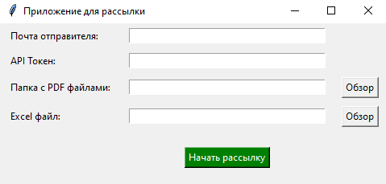

# Рассылка через мини-приложение #

Маленькое и простое приложение для рассылки через API Token.



**Функционал:**

`def send_emails(folder_path, excel_path, sender_email, token):`
- Основная функция, которая дает делать поиск в выбранной папке с файлами и exel файла. Так же работу указанного токена и почты.

```python
# Поиск файла
            pdf_file_name = f"{full_name}.pdf"
            pdf_file_path = os.path.join(folder_path, pdf_file_name)
```
- Сам поиск файла
- `encoded_pdf = base64.b64encode(pdf_content).decode('utf-8')` принцип работы с файлами pdf формата

```python
 email_body = {
                "message": {
                    "subject": "Ваш документ",
                    "body": {
                        "contentType": "Text",
                        "content": f"Уважаемый(ая) {full_name},\n\nВо вложении вы найдете ваш документ."
                    },
                    "toRecipients": [
                        {"emailAddress": {"address": recipient_email}}
                    ],
                    "attachments": [
                        {
                            "@odata.type": "#microsoft.graph.fileAttachment",
                            "name": pdf_file_name,
                            "contentBytes": encoded_pdf
                        }
                    ]
                }
            }
```
- Внутрянка сообщения, отправленного пользователям.